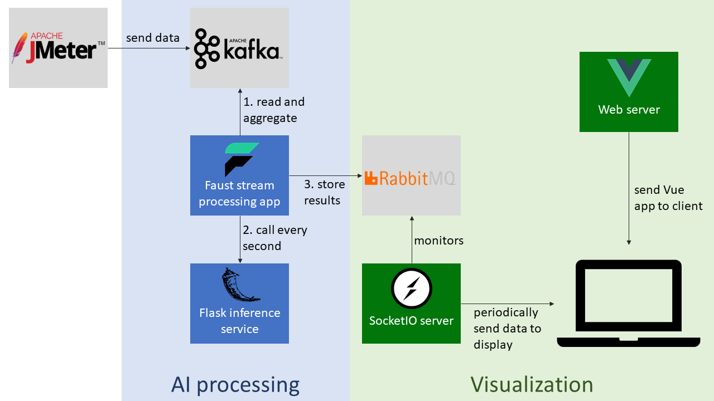

# AI_Component

The components of the AI part (as shown in the diagram below) are containerized
and available at the following repositories:

- https://quay.io/repository/mdeloche/power10-mma-baseimage (used as root image for other components)
- https://quay.io/repository/mdeloche/power10-mma-inference-server
- https://quay.io/repository/mdeloche/power10-mma-stream-processing
- https://quay.io/repository/mdeloche/power10-mma-socketio-server
- https://quay.io/repository/mdeloche/power10-mma-mqtt-realtime-chart



The recommended way is to use these images and the `run_demo.sh` script. Instructions to run manually are also provided below.

## [Containers] How to run

Requirements:

- `podman`

### Start demo

Use the `run_demo.sh` script, providing the URL of the Kafka broker from which to read DayTrader data:

```
KAFKA_BROKER="kafka://10.20.30.40:9092" ./run_demo.sh
```

### Stop demo

```
./stop_demo.sh
```

## [Manual setup] How to run

### Environment setup

* ensure that Git repository is cloned

```
cd AI_Component/
```

* install conda

```
wget https://repo.anaconda.com/archive/Anaconda3-2021.05-Linux-ppc64le.sh
sh Anaconda3-2021.05-Linux-ppc64le.sh -b
/root/anaconda3/bin/conda init && source /root/.bashrc
```

* restore "opence" conda environment

```
conda env create -f opence-conda-env.yml
echo "conda activate opence" >> /root/.bashrc && source /root/.bashrc
```

[BACKUP] With ausgsa channel:

```
conda create -n opence python=3.8
conda install flask numpy pandas scipy scikit-learn statsmodels kombu eventlet nodejs
pip install pytorch_forecasting faust python-socketio==4.0.0 python-engineio==3.2.0
```

1. Launch RabbitMQ (`docker login docker.io` might be required)

```
podman run -d --rm --name rabbitmq -p 5672:5672 -p 15672:15672 rabbitmq:3-management
```

2. Download trained model checkpoint 
using [this link](https://ibm.box.com/v/nbeatsonnxmodel)
and place the `n-beats.onnx` file in the `src/inference-server/` folder

3. Run inference server

```
cd src/inference-server/
PYTHONPATH=/root/AI-Usecases/src/training:$PYTHONPATH python3 inference_server_onnx.py

```

4. Run streaming service (update the `KAFKA_BROKER` variable to point to the URL and port of Kafka)

```
cd ../stream-processing/
KAFKA_BROKER="kafka://10.20.30.40:9092" python3 streaming_app.py worker -l info
```

5. Run SocketIO server

```
cd ../visualization/ && python3 ./socketio-server/server.py
```

6. Run Vue web server

```
git clone https://github.com/MaximeDeloche/mqtt-realtime-chart-client && cd mqtt-realtime-chart-client/
npm install && npm start
```

Note: the visualization range can be changed manually in the `visualization/mqtt-realtime-chart-client/src/components/Home.vue` file (`min` and `max` values lines 77 and 78). 

6. Connect to `http://server-ip:9080`

Note: you might need to:

* disable SELinux: `sudo setenforce 0`
* open ports 9080 (web server) and 9081 (websocket connection): `firewall-cmd --add-port=9080/tcp` and `firewall-cmd --add-port=9081/tcp`

7. Launch JMeter. Connect to the IBMi system and run:

```
/QOpenSys/ocp5/jmeter/bin/jmeter -n -t /QOpenSys/ocp5/daytrader7.jmx -JHOST=127.0.0.1 -JPORT=10200 -JTHREADS=10 -JDURATION=120 -l jmeter_log.txt
```

## Sources

* [Nick Jokic - Real-time visualization of high-frequency streams](https://itnext.io/javascript-real-time-visualization-of-high-frequency-streams-d6533c774794#ad5d)
